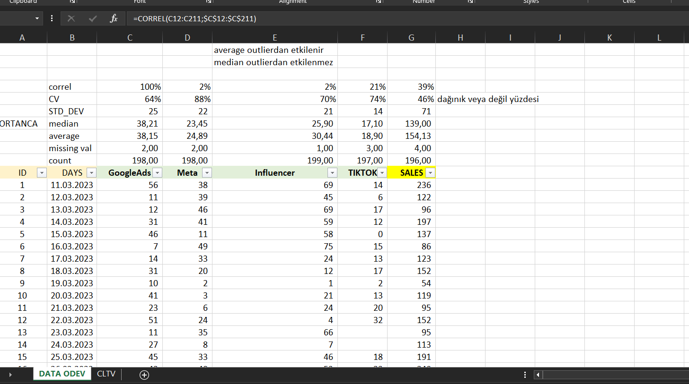
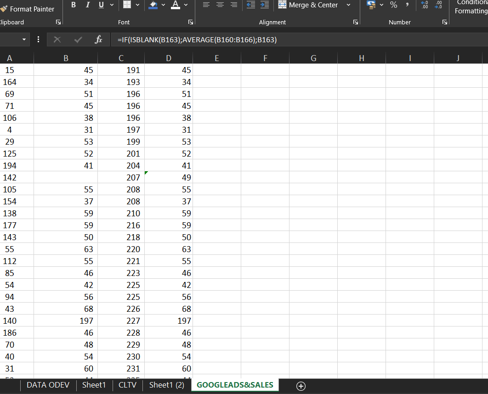
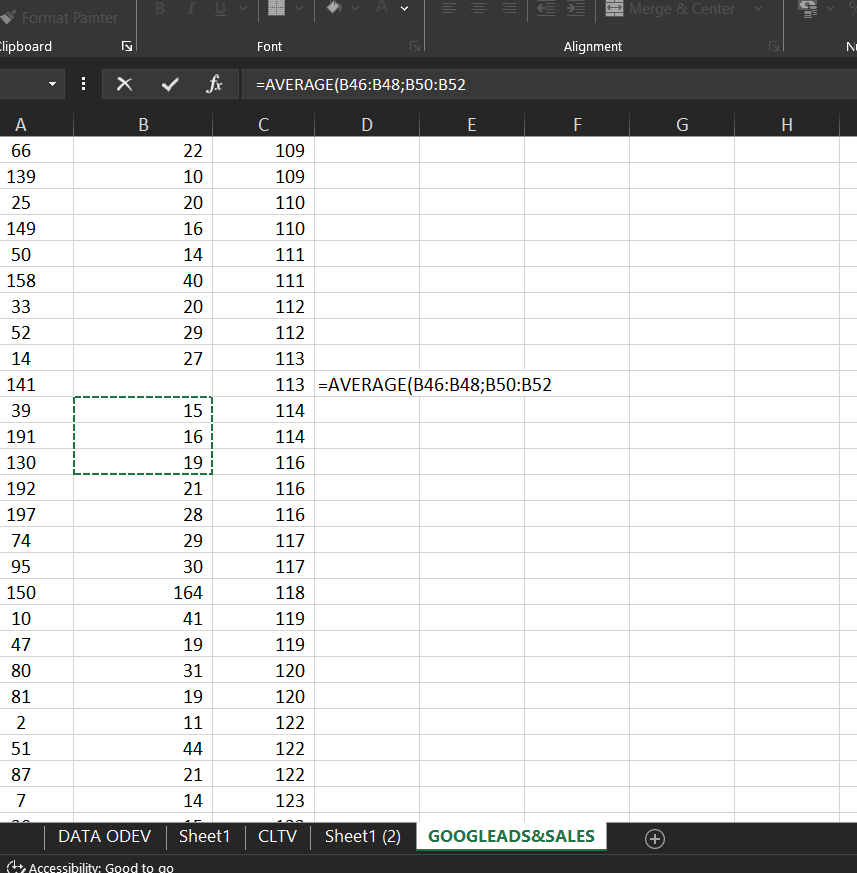
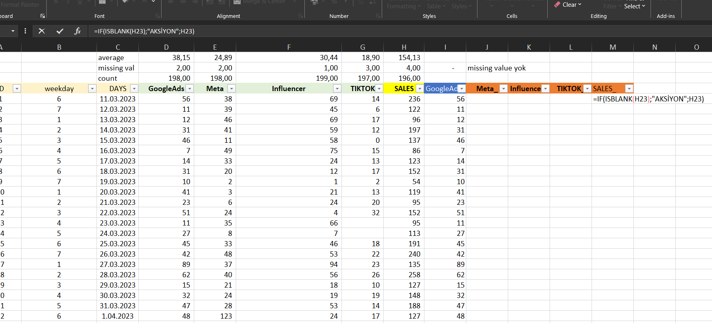
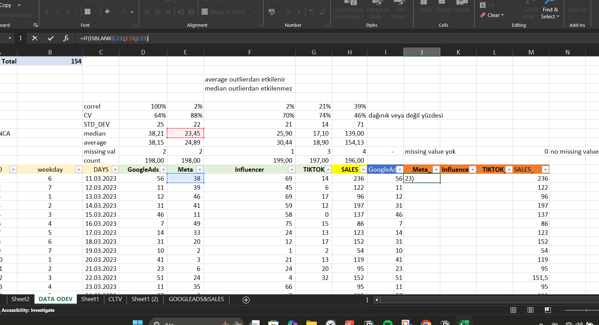
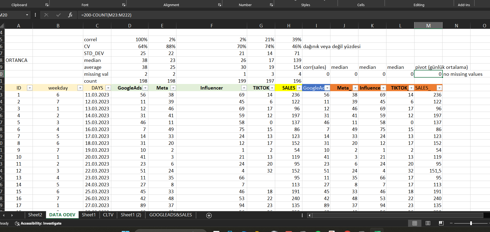


# 📊 Dijital Reklam Verisi Üzerine Excel Analizi

Bu projede Google Ads, Meta, TikTok ve Influencer reklam harcamalarının satışlar üzerindeki etkisini analiz ettik. Excel ortamında temel istatistiksel analiz, eksik veri doldurma, korelasyon hesaplama ve PivotTable görselleştirme işlemleri gerçekleştirildi.

---

## 🔍 Genel Amaç
- Dijital reklam kanallarının satışlar üzerindeki etkisini görmek
- Korelasyona göre eksik verileri mantıklı biçimde doldurmak
- Satışların hafta içi ve hafta sonu değişimini analiz etmek

---

## 📸 Görsel Açıklamalı Analizler

### 📌 Google Ads & Sales Korelasyonu
  
Google Ads ile Meta reklam harcamaları arasında düşük korelasyon gözlemlenirken, Google Ads ile Sales arasında %39'luk bir korelasyon bulundu. Bu nedenle analiz Google Ads ve SALES üzerinden devam ettirildi.

---

### 🧠 Eksik Veri Doldurma – Google Ads
  
Satışın yüksek olduğu yerde Google Ads değerlerinin de yüksek olması gerektiği varsayılarak, eksik Google Ads verileri önceki ve sonraki 3 değerle ortalaması alınarak dolduruldu.  

Formül:
```excel
=IF(ISBLANK(B163), AVERAGE(B160:B166), B163)
```

---
### 🧮 Average ile Sales kolonundan GoogleAds verilerini doldurduk
  
 
---

### 📅 Gün Bazlı Tamamlama Stratejisi
  
Eksik değerlerin haftanın gününe göre doldurulması gerektiği durumlarda, ilgili haftanın ortalama satış değeri PivotTable yardımıyla tespit edilerek VLOOKUP fonksiyonu ile otomatik olarak atandı.

```excel
=VLOOKUP([@weekday], pivot_tablo_alanı, 2, FALSE)
```

---

### 🧼 Meta Sütununda Median ile Temizleme
  
Meta sütunundaki eksik veriler, veri setindeki medyan değeri (23) ile dolduruldu.

Formül:
```excel
=IF(ISBLANK(E23), 23, E23)
```

---

### ✅ Final Kontrol – Eksik Veri Kalmasın
  
Tüm eksik veriler median ya da average kullanılarak haftalık eğilimlere ve korelasyona uygun şekilde dolduruldu. Final kontrolde missing value kalmadığı gözlemlendi.

---

## 📈 Kullanılan Teknikler
- Pivot Table ile gün bazlı satış analizi
- Korelasyon katsayısı hesaplama
- Ortalama, medyan, standart sapma
- ISBLANK, AVERAGE, VLOOKUP fonksiyonları

---

## 🧠 Sonuç
Google Ads ile satışlar arasında anlamlı bir ilişki olduğu görülmüş, eksik veriler bu ilişkiye göre mantıklı şekilde doldurulmuştur. Excel üzerinde veri temizliği, temel istatistikler ve fonksiyonel otomasyon konularında başarılı bir uygulamadır.

---

## 🗂 Dosya Yapısı

```
/images/
    correlation_googleads_sales.png
    gads_sales_fill_missing.png
    paste_values_main.png
    weekday_average_fill.png
    meta_fill_median.png
    no_missing_final.png

README.md

